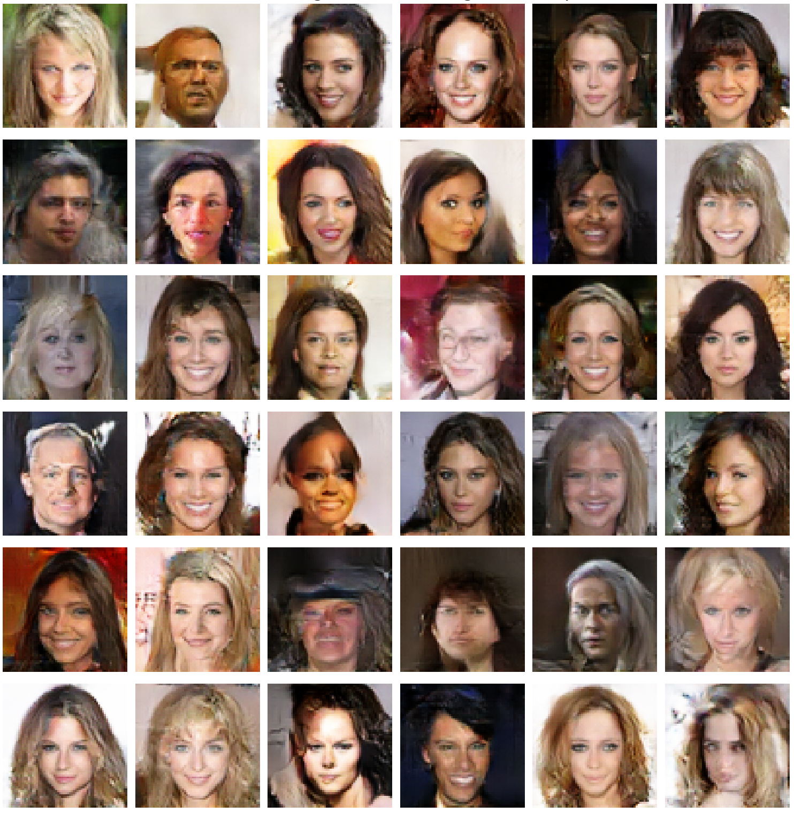

# 🎭 Photorealistic Face Generation using DCGANs

## 🌐 Overview
Inspired by the intriguing website [This Person Does Not Exist](https://thispersondoesnotexist.com/), this project aims to design a model capable of producing photorealistic face images that, although resembling real people, are completely synthesized. Due to resource constraints, we are focusing on generating images at a lower resolution of 64x64 pixels, utilizing a subset of the [CelebFaces Attributes (CelebA) Dataset](http://mmlab.ie.cuhk.edu.hk/projects/CelebA.html) available on [Kaggle](https://www.kaggle.com/datasets/farzadnekouei/50k-celebrity-faces-image-dataset). Our chosen method for image synthesis is the **Deep Convolutional Generative Adversarial Networks (DCGANs)**. The dataset undergoes rigorous preprocessing to ensure optimal results, ultimately training our DCGAN to synthesize new, lifelike faces that evoke the essence of the celebrities in our training set, albeit in a fabricated manner.

## 🎯 Objectives
- **Loading and Preprocessing the Dataset**: Preparing the CelebA dataset for training and testing phases.
- **Define DCGAN Architecture**: Defining the architecture for the Discriminator, Generator, and the combined GAN model.
- **Prepare Data for Training DCGAN**: Creating training batches for the Discriminator and Generator.
- **Train DCGAN & Monitor Progress**: Handling the simultaneous training of the Generator and Discriminator in our GAN model and visualizing the progress.

## 📊 Dataset
The dataset used for this project is a subset of the CelebFaces Attributes (CelebA) Dataset, available on Kaggle [here](https://www.kaggle.com/datasets/farzadnekouei/50k-celebrity-faces-image-dataset).

### Dataset Overview:

## 📁 File Descriptions
- 📓 **`photorealistic-face-generation-using-dcgans.ipynb`**: Jupyter notebook containing all stages of data exploration, preprocessing, modeling, training, and analysis.
- 📄 **`README.md`**:  The file you're currently reading, offering an extensive overview and useful insights regarding the project.

## 🚀 How to Execute
1. Clone this repository to your local machine.
2. Launch the `photorealistic-face-generation-using-dcgans.ipynb` notebook in Jupyter.
3. Execute all cells in the notebook. Ensure you have enough resources to train the network.

### Generated Images by Generator after 250 Epochs:

⚠️ **Note**: A higher number of epochs could potentially lead to even more realistic and refined results.

## 🔗 Additional Resources
- 🌐 **Kaggle Notebook**: Interested in a Kaggle environment? Check out the notebook [here](https://www.kaggle.com/code/farzadnekouei/photorealistic-face-generation-using-dcgans).
- 📂 **Original Dataset**: Access the original CelebA dataset [here](http://mmlab.ie.cuhk.edu.hk/projects/CelebA.html).
- 🤝 **Connect on LinkedIn**: Have questions or looking for collaboration? Let's connect on [LinkedIn](https://linkedin.com/in/farzad-nekouei-7535aa53/).

